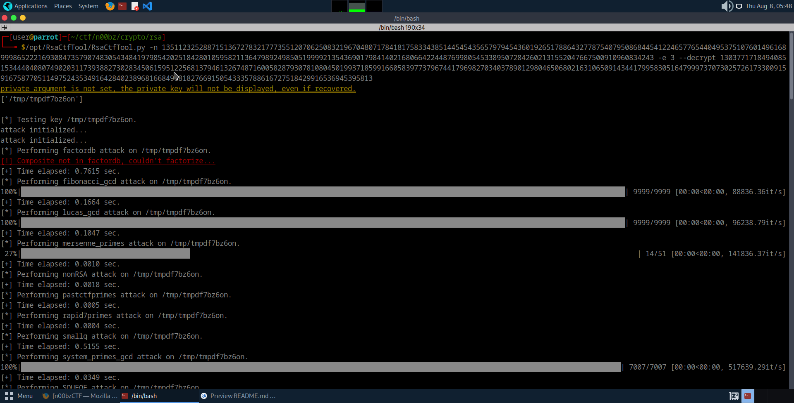
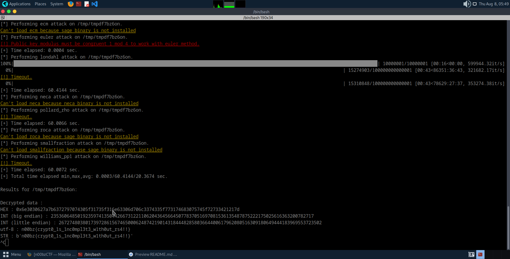

# RSA

**Category**: Crypto **Score**:100 **Author**: noob_abhinav

## Description

The cryptography category is incomplete without RSA. So here is a simple RSA challenge. Have fun!

## Attachments

- [`encryption.txt`](encryption.txt)

## Solution

In tackling this RSA challenge, my initial approach involved scripting a Python solution to calculate the cube root of c with high precision, given that e is small and c is less than n. However, upon discovering the RsaCtfTool, I opted to utilize its powerful capabilities to see it in action.

Here’s the process:

First, I executed the RsaCtfTool on the given challenge parameters...\

...and observed its impressive decryption process in action.

And boom! We've got the flag:

Flag: n00bz{crypt0_1s_1nc0mpl3t3_w1th0ut_rs4!!}
