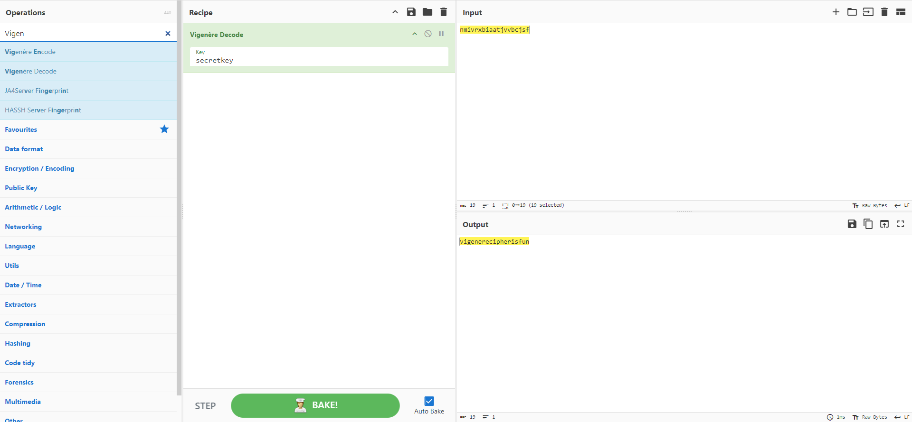

# Vinegar

**Category**: Crypto **Score**:100 **Author**: noob_abhinav

## Description

Can you decode this message? Note: Wrap the decrypted text in n00bz{}.

## Attachments

- [`enc.txt`](enc.txt)

## Solution

This challenge is straightforward, as the title hints at a Vigenère cipher. With the key provided, decrypting the encoded flag becomes much easier. While it's possible to write a Python script for this, we opted to use one of the best cryptographic tools available: CyberChef.

Here’s how we did it:

1. We selected the "Vigenère Decode" recipe in CyberChef.
2. We entered the encoded text "nmivrxbiaatjvvbcjsf" and the key "secretkey".
3. CyberChef then decoded the message for us, revealing the flag: "vigenerecipherisfun".

 

Flag: n00bz{vigenerecipherisfun}
